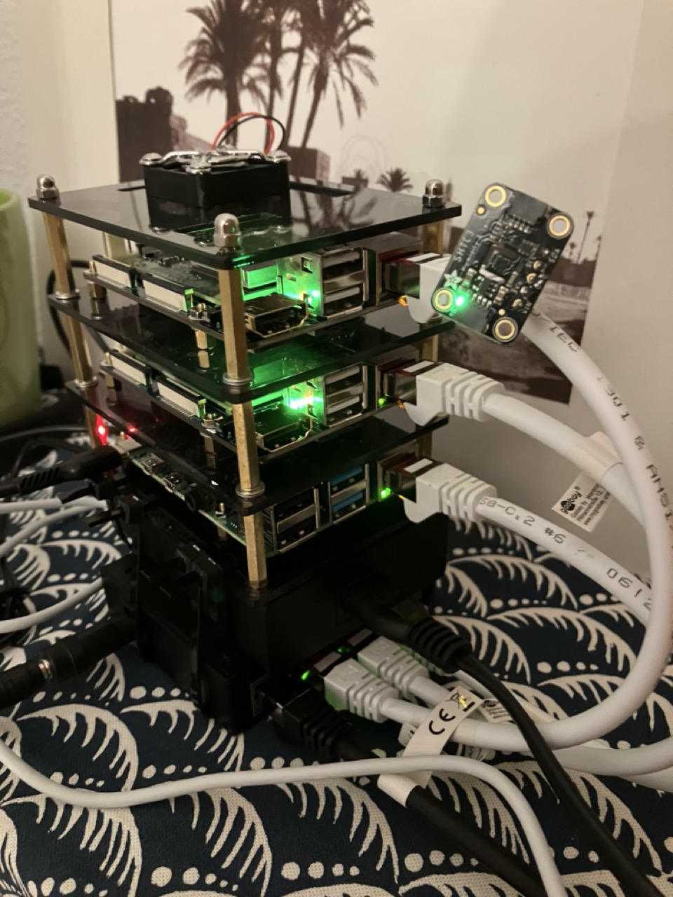

This article explains how to set up a Raspberry Pi Kubernetes cluster as a home server, using k3s together with Longhorn for persistent volumes and MetalLB + Traefik to expose services locally and publicly. As a disclaimer, this is not the fastest and cheapest way to get a home server up and running. For that, you would be better off reusing an old laptop or desktop computer. However, if you enjoy tinkering with hardware and software, and are willing to learn Kubernetes, then this project is for you.

## Motivation

My motivation for this project was primarily educational. I wanted to learn more about Kubernetes and how to set up and manage a cluster. I also wished to have a home server that I could use to host a few services. I chose to use Raspberry Pi's because:

- I didn't have a spare computer. For this project, you don't Raspberry Pi's actually. A spare computer with some virtual machines would work just as well.
- Raspberry Pis consumes little power, which is crucial for a home server running 24/7.

Although a Kubernetes cluster is overkill for a home server, it has some pretty nice advantages:

- infrastructure-as-code: all your resources are defined in YAML files.
- if you use physical machines, you can set it up to automatically back up/mirror your data.

Other nice features, though not essential for a home server, include:

- easy to scale up or down your cluster depending on your need, by adding or removing nodes.
- availability of services: if a node fails, Kubernetes will automatically reschedule the pods on another node.

There are some constraints to bare in mind:

- Kubernetes is not the most straightforward system to set up and manage. Depending on your prior knowledge and ambitions to manage your home server, it can be a steep learning curve.
- It's not the most resource-efficient system.

With all that said, let's get started!

## Hardware


In this project, I used the following hardware (mostly because that's what I had lying around):

- 2 Raspberry Pi Compute Modules 4 (CM4) with 8GB of RAM and 32GB of eMMC storage, mounted on a [WaveShare Base Board A](https://www.waveshare.com/cm4-io-base-a.htm).
- 1 Raspberry Pi 4B with 4GB of RAM and a 32GB microSD card.
- 1 Raspberry Pi 4B with 8GB of RAM and a 32GB microSD card.
- 2 2TB external hard drives.
- 2 500GB nvme 2242 SSDs to put in the CM4s.
- a [cheap 4 port network switch](https://www.amazon.co.uk/TP-Link-LS1005G-Wallmount-Ethernet-Splitter/dp/B07VWB347G?crid=34Z5LL4JOTI3L&dib=eyJ2IjoiMSJ9.UD7H_VEIKmTVGSRydG30N-O1YpUo7L3iaHnZTjkEXUhc1cO0rlGnA-SGhdex_14VE2uTtrohd-dXZx0WTvbTO8UvudxX722okYGedrxMnJQI644xwwo7vOfvysoXawUt3CcNP_CgaNn4FeItkrrmxgY7igu_ox_v8k0X8k1koq1qVvygreDXfoZKVzEiuk-88t7rEdVqWy-0sKYpZqhPGcBfHZIcGWn09nc9ZmNJtmI.AxdTqM0_JG8x8dYoX-Wa_jBcOKmhdEZtI4OpwUW1XCU&dib_tag=se&keywords=tp+link+network+switch&qid=1741447591&sprefix=tp+link+netw%2Caps%2C133&sr=8-6).
- 4 short ethernet cables to plug the RPis to the switch + 1 long to plug the switch to the router.
- 1 [USB charging station](https://www.amazon.co.uk/Anker-PowerPort-Family-Sized-Technology-Smartphones-Black/dp/B00PK1IIJY?crid=2PWVXQNAC2DVY&dib=eyJ2IjoiMSJ9.lTByv8jPqXWv8jcnQ1YPalpQ-WXfVioppR1oqdEzMPdux4alR8l7ZXoKiduOxczNQGWfYORz9gz3Ctvx4NN4KWCS53gnGJ4GR2AEECWlzBdoxfvFQ-fa3xztrRHdRveoWZPwdLeWQukFkOBqWKFKbxHAQ1658BradfDaEJQY_46HR9TWtTPS3qxxlEoHJrCQsCSmlDTHZNWF98iZmQD3A9xzYndWK2UjKtUzFepiMnU.Ooti8axfDHY8z7OectiAPLXvo845b6vpAcSUrcQopR4&dib_tag=se&keywords=anker+usb+charger&qid=1741448197&sprefix=anker+usb+charger%2Caps%2C106&sr=8-6) with a few short USB-C to A cables to power the Pis. This is convenient to use only one plug to power the whole system.
- 1 USB-A to barrel jack cable to power the switch.

A case to keep everything tidy is also a good idea. A [stackable one](https://www.amazon.co.uk/GeeekPi-Raspberry-Cluster-Heatsink-Stackable/dp/B07MW24S61?crid=2OO31Q80TGW5I&dib=eyJ2IjoiMSJ9.-Xbmfm0zqmUAE6zv4WXI6Dm4wTt4vAUKdxGaY9xBxmf9Wa0KcJHiPyQw1Ch6Cl-xXxLKwWwEQ13ornG7Ir2RO7UaIiJaIM4ebQUUX2HbewdUgRsp0vvGkGsmRSfAHRrwMgqD49LYN1-vJwGjq0FvMlmOmszXi8wLEw99H3AaaqKL-it7U649zlJyhjQ4_-V6fkqhclc1MpnB9ZjVhxfAL3ThF3IawEhl6wW-sX2CD2A.1OnL57ozkhQSissh1hgVEUz7zJjnwrfVb5lJF1w_Ou0&dib_tag=se&keywords=raspberry+pi+cluster+case&qid=1741447781&sprefix=raspberry+pi+cluster%2Caps%2C110&sr=8-3) is a cheap and handy option, although it will only take care of your RPis: the switch, supply and hard drives will still be dangling around... I zip-tied the network switch and the power supply at the base of RPis stack to make it (slightly) tidier.

In all fairness, this project would be expensive if you had to buy everything from scratch. Yet you don't need all that: one or two RPis are enough, or an old computer.

<!--  -->

## Setting up the cluster

### Preparing the nodes

For each node, you will need to:

1. flash the OS, either on the eMMC or on the microSD card. To flash on the eMMC, you can follow the [nice tutorial from Jeff Geerling](https://www.jeffgeerling.com/blog/2020/flashing-raspberry-pi-compute-module-on-macos-usbboot). I chose to go with Raspbian, and flashing with the [Raspberry Pi Imager](https://www.raspberrypi.org/software/), since it conveniently allow you to put your SSH key directly in the system, so you can seamlessly connect to your RPis without needing to plug a keyboard and a display on them. You can also directly set a hostname and a user.
2. ssh to the node, and make some updates:

```bash
sudo apt-get update && sudo apt-get upgrade
```

3. set up a static IP address. You can do this by editing the `/etc/dhcpcd.conf` file:

```bash
interface eth0
static ip_address=<your_ip>/24
static routers=<your_router_ip>
static domain_name_servers=<your_dns>
```

Make sure you also exclude these IPs from your router's DHCP range, so they don't get assigned to other devices. This step isn't mandatory, but strongly advised since it makes it easier to connect to your RPi. Morever, depending on what solution you want to use to manage persistent volumes in Kubernetes, it is actually necessary. More on that very soon.

4. install Docker. You can follow the [official guide](https://docs.docker.com/engine/install/debian/), or simply run:

```bash
curl -fsSL test.docker.com -o get-docker.sh && sh get-docker.sh
sudo usermod -aG docker <user_name (xam)>
sudo systemctl enable docker # to enable docker on start
rm get-docker.sh
```

5. edit `/boot/cmdline.txt` to enable OS container features, and reboot:

```bash
sudo sed -i '$ s/$/ cgroup_enable=cpuset cgroup_enable=memory cgroup_memory=1 swapaccount=1/' /boot/cmdline.txt
sudo reboot
```

6. if you also use external hard drives, we can make sure they are automatically mounted at boot:

```bash
# list them
sudo fdisk -l
# format it
sudo mkfs -t ext4 <device>
# get its UUID
sudo blkid <device>
# create a mount point for it
sudo mkdir -p <path>
```

Then add `"UUID=<UUID>  <path>               ext4    defaults,noatime  0       2"` to `/etc/fstab`.

We are now ready to install Kubernetes on the nodes.

#### Optional steps

A few complementary steps you can take:

- deactive wifi and bluetooth. It saves a bit of power, and reduces the surface of attack:

```bash
sudo rfkill block bluetooth
sudo rfkill block wifi
```

- install `unattended-upgrades` to automatically update your system:

```bash
sudo apt-get install unattended-upgrades
```

### Installing Kubernetes

We will use [k3s](https://k3s.io/), a lightweight Kubernetes distribution. It is remarkably easy to install. One node will need to have the _master_ role, while all others will be _workers_. On the master node, run:

```bash
curl -sfL https://get.k3s.io | K3S_KUBECONFIG_MODE="644" INSTALL_K3S_EXEC="server --disable traefik --disable servicelb" sh -s -
```

Note that we disable `traefik` because we will (optionally) install our own version of it. We also disable `servicelb` because we will use [metallb](https://metallb.io/) instead. More on that later.

On the worker nodes, simply run:

```bash
curl -sfL https://get.k3s.io | K3S_URL=https://<master IP>:6443 K3S_TOKEN="<k3s token>" sh -
```

where `<master IP>` is the IP of the master node, and `<k3s token>` is the token generated on the master node after the installation.

Congrats! You now have a Kubernetes cluster up and running! To interact with it, you can copy the kubeconfig file from the master node to your local machine using (from your local machine):

```bash
scp <user>@<master_ip>:/etc/rancher/k3s/k3s.yaml ~/.kube/config
```

You will need to install `kubectl` on your local machine to interact with the cluster. You can follow the [official guide](https://kubernetes.io/docs/tasks/tools/). Once this is done, you can check the status of the cluster with:

```bash
kubectl get nodes
```

### Managing persistent volumes

If you want to use persistent volumes in your cluster, you will need to set up a storage solution across your nodes. I chose to use [Longhorn](https://longhorn.io/), because you can easily set it up to mirror your volumes, a pretty nice feature for a home server. Having said that, a simpler NFS server would also do a great job. To set up Longhorn, follow these steps **on each of your nodes**:

1. install and start its dependencies (nfs actually):

```bash
sudo apt-get install jq open-iscsi nfs-kernel-server portmap nfs-common
sudo systemctl enable rpcbind.service
sudo systemctl enable nfs-server.service
sudo systemctl start rpcbind.service
sudo systemctl start nfs-server.service
```

2. in your mounted hard drive, create a directory to store the data:

```bash
sudo mkdir -p <path>
```

3. edit the `/etc/exports` file to add the path to the volume you want to share:

```bash
<path>        <node1-ip>(rw,sync,crossmnt,no_subtree_check) <node2-ip>(rw,sync,crossmnt,no_subtree_check) <node3-ip>(rw,sync,crossmnt,no_subtree_check) <node4-ip>(rw,sync,crossmnt,no_subtree_check)
```

4. export the volume:

```bash
sudo exportfs -a
```

5. (optional) if you want to encrypt the data, you can use `dm-crypt`.

You can now install Longhorn on your cluster. To do so, run:

```bash
kubectl apply -f https://raw.githubusercontent.com/longhorn/longhorn/v1.8.1/deploy/longhorn.yaml
```

You can check the status of the installation with:

```bash
kubectl -n longhorn-system get pod
```

The final step is to create a storage class for Longhorn. Check [my manifests](https://github.com/xamcost/homeserver/blob/main/deployment/longhorn/015-longhorn-storageclasses.yaml) for a few examples. In my case, I created several storage classes to leverage:

- a _disk selector_: to choose whether to store the volume of a given service in the nvme or hard drives.
- a _number of replicas_: set to 2 since I have 2 disks of each type, so you always have a backup at hand. A killer feature!
- a _Retain_ or _Delete_ policy: to choose whether to keep the data when the volume is deleted.
  Create storage classes to fit your needs!

## Exposing your services

At this stage, your cluster is ready to host your services, i.e. you can now deploy your applications on it with persistent volumes. Before going further, let's discuss what your options are to access these services.

### Using port-forwarding

You can already access your services within your local network using kubernetes port-forwarding. For instance, you can access the longhorn UI with:

```bash
kubectl -n longhorn-system port-forward svc/longhorn-frontend 8080:80
```

While this is a viable option, it's not very convenient to execute this command each time. Moreover, it doesn't allow you to access your services from outside your local network.

### Using MetalLB

If the only thing you want is to expose your services in your local network, _MetalLB_ is enough. You can [install it with a single command](https://metallb.io/installation/#installation-by-manifest):

```bash
kubectl apply -f https://raw.githubusercontent.com/metallb/metallb/v0.14.9/config/manifests/metallb-native.yaml
```

Then, you will need to create to define the IP range that _MetalLB_ can use. You can do so by applying the following manifest (adapt it to your needs):

```yaml
---
apiVersion: metallb.io/v1beta1
kind: IPAddressPool
metadata:
  name: ip-pool
  namespace: metallb-system
spec:
  addresses:
    - '<start-ip>-<end-ip>'

---
apiVersion: metallb.io/v1beta1
kind: L2Advertisement
metadata:
  name: l2-advertisement
  namespace: metallb-system
spec:
  ipAddressPools:
    - ip-pool
```

Don't forget to also exclude this range from your router's DHCP range. You can now expose your services with a `LoadBalancer` service type. For instance, to expose the longhorn UI, you can run:

```yaml
---
apiVersion: v1
kind: Service
metadata:
  name: longhorn-lb
  namespace: longhorn-system
  annotations:
    metallb.universe.tf/loadBalancerIPs: <your_ip>
spec:
  ports:
    - name: longhorn-frontend
      port: 8080
      protocol: TCP
      targetPort: 80
  selector:
    app: longhorn-ui
  type: LoadBalancer
```

Your service will now be accessible at `<your_ip>:8080`.

That's more convenient than port-forwarding, but it still doesn't allow you to access your services from outside your local network.

### Using cloudflare tunnels

Using [Cloudflare tunnels](https://developers.cloudflare.com/cloudflare-one/connections/connect-networks/) is an easy way to expose your services to the internet without poking a hole in your router's firewall. It's also free and make it easy to set up some security (authentication, access rules, ...). However, you will need to open a Cloudflare account, and add your own domain name to it. There are a lot of tutorials around to do this ([this one] for instance). To run the _cloudflared_ daemon in Kubernetes, you can use [my manifest](https://github.com/xamcost/homeserver/blob/main/deployment/cloudflared.yaml): just put in there your own cloudflare token.

If you go that way, please remember to secure your services. Let me insist on that: most tutorials online, especially blog posts, stop after setting a route between a service to expose and a subdomain. Yet your service is exposed to the internet, so anyone can visit them. To secure them, the bare minimum should be to:

- put some authentication. **BEFORE** creating the route, you can add some authentication methods in the _Settings > Authentication_ tab of the Cloudflare Zero Trust dashboard. You can use for instance use your Github account to authenticate.
- create some access rules. **BEFORE** creating the route, you can add some access rules in the _Access_ tab of the Cloudflare Zero Trust dashboard. You can for instance restrict access to any country except yours, put some rate limiting...

One last thing to note is that all your traffic will go through Cloudflare's servers. This is a good thing for security, but it also means that they can see all your traffic. If you are concerned about that, you should use another method such as VPN.

### Using a VPN

To access your services outside your home without exposing them publicly, you can use a VPN. Nowadays, there are a lot of options to quickly and easily set up one. The easiest is probably to use a service like [Tailscale](https://tailscale.com/): their free tier is quite generous, so they got you covered. Check [their docs](https://tailscale.com/kb/1017/install) to get started. No personal domain needed.

Alternatively, you can also consider other solutions such as setting up your own VPN server using [PiVPN](https://www.pivpn.io/) or [Wireguard Easy](https://wg-easy.github.io/wg-easy/Pre-release/). For these solutions, you will need a domain name + a dynamic DNS service to update the IP associated with your domain periodically (many Docker services are available for this online, like [this one](https://github.com/joshuaavalon/docker-cloudflare)), or you can use [DuckDNS](https://gist.github.com/taichikuji/6f4183c0af1f4a29e345b60910666468).

This solution is a very good compromise between security and convenience.

### Setting up a reverse proxy

A last way to expose your services is to use a reverse proxy. This is a bit more complicated than the other solutions, but it gives you more control over the traffic. You can actually use this in conjunction with the VPN solution to access your services using a nice human readable URL and avoid annoying HTTP warnings (see [this excellent video](https://www.youtube.com/watch?v=qlcVx-k-02E&t=300s) from Wolfgang's channel explaining this technique). Let's get into how to make this work in our cluster setup. For this, we will use [Traefik](https://doc.traefik.io/traefik/getting-started/quick-start/): it will act as both a reverse proxy and an ingress controller in our cluster. Moreover, it will take care of generating and renewing certificates for us. You can use [my manifests](https://github.com/xamcost/homeserver/tree/main/deployment/traefik) to deploy it in just two steps, assuming that you deployed MetalLB, and that you have your domain managed by Cloudflare:

1. create the necessary environment variables:

```bash
export TRAEFIK_USER_KEY='' # a secret key to secure the dashboard: you can generate one using `htpasswd -nb mysecretuser mysecretpassword | base64`
export CF_API_EMAIL='' # the email associated with your cloudflare account
export CF_DNS_API_TOKEN='<cloudflare_token>' # you can get it from your cloudflare account
export CLUSTER_DOMAIN='<subdomain_of_your_domain_pointing_to_your_ip>' # for instance, k8s.example.com
export INGRESS_DOMAIN='<your_domain>'  # example.com
export TRAEFIK_IP='<traefik_local_ip>' # The IP at which MetalLB will expose Traefik
export TRAEFIK_CF_EMAIL='<your_email>' # Just used in the certificate generation
```

2. apply the manifests:

```bash
git clone git@github.com:xamcost/homeserver.git
cd homeserver/deployment/traefik
cat *.yaml | envsubst | kubectl apply -f -
```

⚠️ **Important**: it is very likely that you will need to adapt the manifests to your needs. At least, you will need to change the `storageClassName` in the [persistent volume claim](https://github.com/xamcost/homeserver/blob/main/deployment/traefik/15-pvc.yaml) to match the one your created.

You should now be able to access the Traefik dashboard at `traefik.<your_domain>`. You can also create your ingresses to expose your services at `<service_name>.<your_domain>`, getting HTTPS with automatic certificate generation/renewal for free.

This reverse proxy provides you with a lot of flexibility: if you decide to stop using a VPN and expose your service directly to the internet, you will just need to change the Traefik IP and have your domain pointing to it. In that case, be sure to secure your services by adding an authentication portal that your reverse proxy redirects to. For instance, you can use [Authentik](https://goauthentik.io/) or [Authelia](https://www.authelia.com/). You can also set some extra services like [fail2ban](https://github.com/fail2ban/fail2ban) to protect your server against brute force attacks.

## Wrapping up

In this post, we saw how to set up a Raspberry Pi Kubernetes cluster with k3s, with persistent volumes managed by Longhorn. We also discussed several ways to expose your services to the internet, and went a bit deeper into setting a reverse proxy and how to use it together with a VPN service to access our services with HTTPS without exposing our services publicly. I hope this tutorial was useful to you! If you went this far and set up your own cluster, you can now enjoy deploying more services to it. In [my repository](https://github.com/xamcost/homeserver/tree/main), you will find ready to use manifests to deploy:

- Prometheus & Grafana: to monitor your cluster
- [Pihole](https://pi-hole.net/): to block ads on your network
- [Monica](https://github.com/monicahq/monica): to manage your personal relationships
- Photoprism: to manage your photos
- [Joplin server](https://joplinapp.org/changelog_server/): to sync your notes if using Joplin
- Mosquitto: an MQTT broker if you have some IoT devices at home
- InfluxDB: to store your time series data
- Jellyfin: to manage your media library
- [FreshRSS](https://freshrss.org/): to read your RSS feeds

I had a lot of fun setting up this cluster, and it was my first home server. I have been using it for a little more than a year before moving to a more beefy server, better suited for my growing needs! I hope you will enjoy it as much as I did. If you have any questions, feel free to reach me on [GitHub](https://github.com/xamcost) or [LinkedIn](https://www.linkedin.com/in/mcostalonga/).
