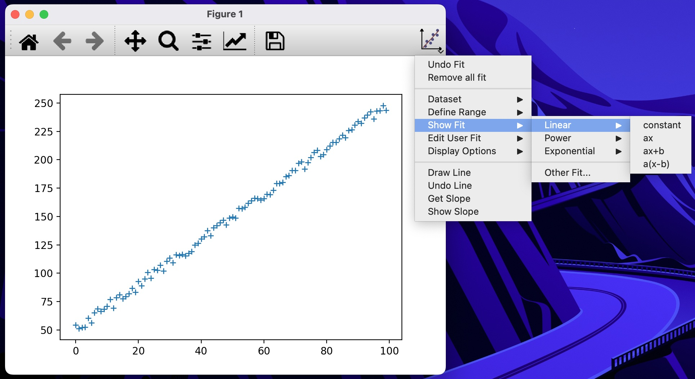

Anafit is a visual curve fitting tool for Matplotlib. It is largely inspired from the [Ezyfit toolbox](http://www.fast.u-psud.fr/ezyfit/) for Matlab. It allows you to fit a curve to your data by interactively adjusting the parameters of the model. It is designed to be easy to use and to provide immediate feedback on the quality of the fit. Anafit is built on top of `matplotlib` and uses the `scipy` library for curve fitting. It is open source and [available on GitHub](https://github.com/xamcost/anafit). 

## Features

Anafit provides the following features:
- interactive curve fitting
- when multiple datasets are present, you can choose which dataset to fit
- you can define your custom fit functions
- drawing lines on the plot and get their corresponding slopes
- drawing lines corresponding to user-defined slopes

## Installation

First, install the required dependencies:

```bash
pip install numpy scipy matplotlib PyQt5
```

Then, install Anafit:

```bash
pip install anafit
```

## Usage

Anafit is very simple to use. Simply pass the matplotlib `Figure` instance to the anafit `Figure` class, and you are ready to go:

```python 
import matplotlib.pyplot as plt 
import numpy as np
import anafit 

fig, ax = plt.subplots()
ax.plot(
    np.arange(0, 100, 1),
    np.arange(50, 250, 2) + 10 * (np.random.rand(100) - 1 / 2),
    "+",
)
ana = anafit.Figure(fig) # [!code highlight]
plt.show()
```

This creates a button in the toolbar of the plot, from which you can access the Anafit interface.



Some example scripts are provided in the [`examples` directory of the repository](https://github.com/xamcost/anafit/tree/master/examples).

## Known limitations

Anafit has some limitations worth keeping in mind:
- it only works with the `Qt5Agg` backend of matplotlib.
- only figures with a single subplot are supported. It can contain multiple datasets, but they must be plotted on the same subplot.

