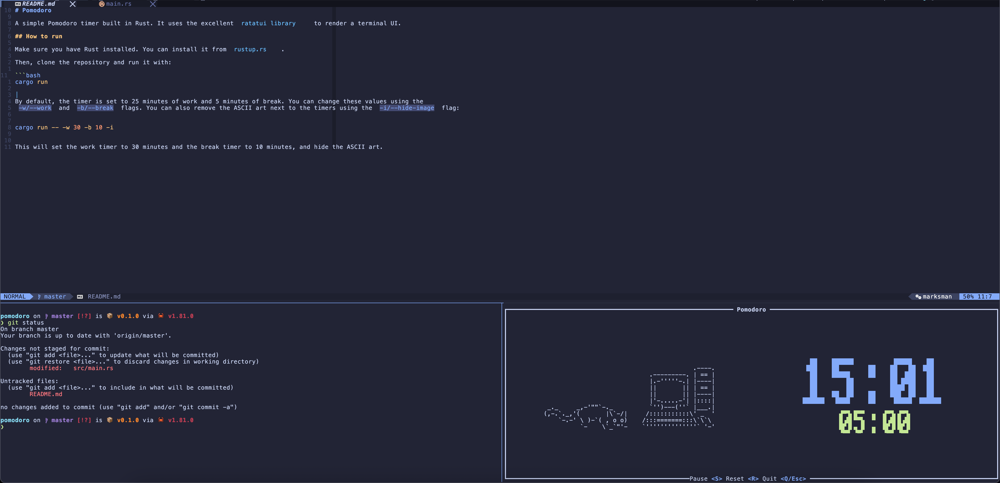

As a beginner project to learn Rust, I built [a simple Pomodoro timer that runs in a terminal](https://github.com/xamcost/pomodoro). The Pomodoro technique is a time management method that uses a timer to break work into intervals, traditionally 25 minutes in length, separated by short 5 minutes breaks. This technique is designed to improve focus and productivity by encouraging sustained concentration and regular breaks.

I particularly like terminal UI apps, since they bring the best of both worlds: a simple, fast and lightweight user interface, while still enabling the efficiency of terminal usage (an incredible example of this is the excellent [lazygit](https://github.com/jesseduffield/lazygit)). It's therefore particularly suited for our pomodoro timer. I used the [ratatui crate](https://ratatui.rs/), which provides convenient tools to build terminal UIs in Rust. It integrates especially well with a terminal multiplexer:



## How it works

The binary is [available on crates.io](https://crates.io/crates/pomodoro-tui), so the easiest way to use it is to first install Rust (for instance using [rustup](https://rustup.rs/)), then run:

```bash
cargo install pomodoro-tui
```

Then, you can run it with:

```bash
pomodoro-tui
```

By default, it will start a 25 minutes Pomodoro session, followed by a 5 minutes break, and repeat. You can customize the duration of the work and break sessions, as well as removing the ASCII art, using command line arguments. For instance, to set the work session to 30 minutes and the break session to 10 minutes and remove the ASCII art, you can run:

```bash
pomodoro-tui -w 30 -b 10 -i
```

You can also use the `-h` flag to see all available options.

## About notifications

If you're on MacOS, the app will notify you when the work or break time is over, by triggering both a notification and playing a sound (using the `say` command).
Don't be too surprised to hear a French accent!
On any other OS, the app won't notify or play a sound. Maybe I'll add this in the future.

## Acknowledgements

This small project to learn Rust has been inspired by my partner, who likes and encourages me to use the Pomodoro technique, even if she doesn't always enjoy breaks when it's time...

I also want to thank the authors of the ASCII art used in the app, which are combinations of works by _jgs_ and _Felix Lee_ you can find [here](https://www.asciiart.eu/computers/computers) and
[here](https://www.asciiart.eu/animals/cats).

_Source of the icon:_ <a href="https://www.flaticon.com/free-icons/pomodoro-technique" title="pomodoro technique icons">Pomodoro technique icons created by Freepik - Flaticon</a>
