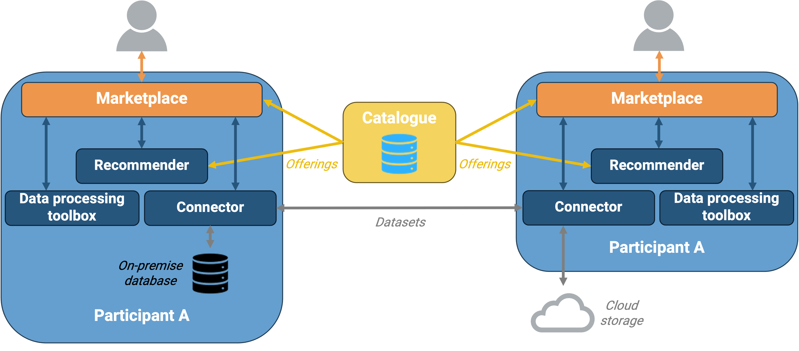

Sedimark is a project funded by the European Commission under the Horizon Europe programme, which aims at creating an ecosystem whose participants can easily share datasets and services seamlessly and securely, while retaining sovereignty on their data. It stands for [SEcure Decentralized Intelligent data MARKetplace](https://sedimark.eu/). This ambitious project involves 12 partners from 8 different countries, and it is expected to run until October 2025.

## How it works

Sedimark participants can use its marketplace to either publish their datasets and services, or to search for datasets and services that they can consume for their own purposes. Such transactions are logged in a digital ledger, [the IOTA tangle](https://www.iota.org/), which guarantees their integrity and immutability. To ensure each provider retains sovereignty on their data/services, Sedimark provides its own **data space connector**, based on the [Eclipse Data Space Components connector](https://github.com/eclipse-edc/Connector), enabling participants to associate usage policies to their datasets and services, while not exposing them directly: connectors act as a proxies between providers and consumers. After an agreement is reached between participants, the consumer can request access to the provider's data: in this case, the provider's connector fetches the data from its source, then handles it to the consumer's connector, which in turn dumps them into a chosen destination. The data space connector also allows participants to share metadata about their datasets and services in a catalogue, so that they can be easily discovered by other participants in the marketplace. Sedimark also comes with a toolbox for data analytics, processing and AI, to help participants make the most of their provided or acquired datasets.

## My role

As a research tech lead at [Eviden](https://eviden.com/about-us/), I lead a small team of two developers: we've been designing, implementing and deploying [the marketplace](https://github.com/Sedimark/marketplace-frontend), working closely with:

- [the LINKS foundation](https://linksfoundation.com/en/), which provides [the toolbox to interact with the IOTA tangle](https://github.com/Sedimark/dlt-booth).
- [the university of Cantabria](https://web.unican.es/en/Pages/default.aspx), implementing the data space components, including its connector.
- [University College Dublin](https://www.ucd.ie/), who develops a recommender system for datasets and services, based on users' interactions with the marketplace.
- [Siemens Romania](https://www.siemens.com/ro/ro.html), providing AI and data analytics services.
- [University of Surrey](https://www.surrey.ac.uk/), who builds Sedimark's data models and provides the catalogue hosting the metadata about datasets and services.
- many other partners, such as [EGM](https://www.egm.io/en/egm-the-innovation-factory) for their expertise in IoT and [the city of Santander](https://www.santander.es/) as uses cases for the marketplace.

My efforts in this project therefore focus on:

- project management: leading the marketplace developers team, coordinating with other partners, and ensuring the project is delivered on time and within budget.
- architecture design: coordinating with other partners to design the overall Sedimark architecture, ensuring it meets the project's requirements and the constraints of each partner.
- frontend development contributor: to build a user-friendly interface for the marketplace, designed with [Figma](https://www.figma.com/), implemented with [Next.js](https://nextjs.org/).
- devops:
  - hosting the marketplace and other fundamental Sedimark components in a Kubernetes cluster we managed in our own servers.
  - setting up a CI/CD pipelines to ensure the marketplace is always up-to-date and secure.
  - but also as an administrator of the [Sedimark GitHub organization](https://github.com/Sedimark), providing runners and managing repositories.
